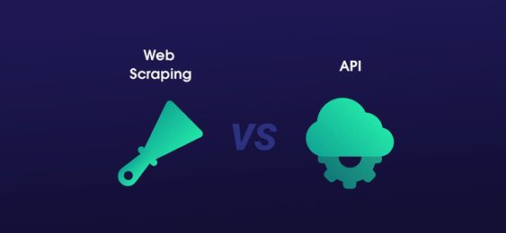

# API and Web Data Scraping Project 

## 1. Project Overview
For this project, I have chosen an API to obtain data from, and a web page to scrape data from, both by using Python3.
The main purpose has been to practice what we learned during our classes, and have better knowledge of how they work and the advantages/disadvantages for each of them.

## 2. API Project
For the API project, one of the tough tasks and main obstacle was to select an API to work with, since there is a plenty of APIs, each of them with different purpose, characteristics and restrictions, and many of them required subscription and are not free.

After some diving on internet, I have selected the API named YouTube Data API v3, which is an API that provides access to YouTube data, such as videos, playlists, and channels.

### 2.1 Steps
Once I have an API selected to start my project, I have read trough the API documentation to learn how it works. 
The API documentation can be found here: https://developers.google.com/youtube/v3/docs?hl=es

Within same API documentation, it is described how to create the API Key that will be required to get response from our request. After following these steps, I have imported the API Key into my Jupyter Notebook, storing it as a temporary environment variable to keep it secret, as this is confidential and personal key. 

Once I had my key, I took following steps:
- Importing required libraries, such as json, pandas, requests...
- Definition of URL and its parameters, focusing on IronhackTechSchool Youtube channel.
- Make calls to API to request data, getting response in json format and started extracting useful data from this response.
- Created a function to retrieve the data for all videos for which I made the call.
- Convert data into a Pandas DataFrame for better visualization, which will be then exported to CSV file.

## 3. Web Scrapping Project
For Web Scrapping Project, I have selected to do scrapping on a web page about weather data. 
The main reason for this is that I realized there are not many free/public APIs for this purpose, so Web Scrapping becomes a good alternative. 

After investigating different alternatives, I found that in this case Google does not have an API specific for weather data, and the weather data shown on Google search is actually scrapped from Weather.com. 
While trying to do web scrapping from Google Search results, I found that Google policy does not allow to do scrapping from their website. Thus, I decided to do web scrapping from this original source, so I can later compare the results I obtain with the ones shown by Google.

### 3.1 Steps
In this case, in order to do scrape weather data from Weather.com, I have used techniques such as requests and BeautifulSoup, and main steps have been:

- Importing required libraries
- Definition of URL
- Call Requests and parsing HTML with BeautifulSoup
- Extract the data and storing it in lists, which will be later collected in a dictionary
- Convert data into a Pandas DataFrame, which will be then exported to CSV file.

## 4. Data export
To finalize the projects, I have exported the data into new csv files, saved into folder named "output". The output of APi project is named "ironhack_videos.csv", and the output of Web Scrapping Project is named "weather.csv".

## 5. Some conclusions and lessons learned
- Both API and Web Scrapping are super powerful tecniques to retrieve data. 
- Each API and each website is different and get to understand each one and how they work is essential in order to properly use them and take the most out of them. 
- Web scraping allows you to extract data from any website more freely, but the code developed to retrieve the data is more manual and less robust in long term, since website owner may change its content without prior notice.
- On the opposite side, APIs are more consistent and sophisticated, but they give you access to the data that their owner wants, wchich sometimes might be too limited or expensive and the owner can also limit the number of requests that a user can make.

The most important lesson learned has been to get to understand how each of them work, specially for APIs which require to read and understand the reference documentation and communications protocol behind.

Depending on your target websites and goals, you may need to use both APIs and web scraping tools :) 
