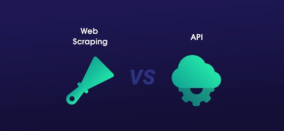

# API and Web Data Scraping Project 

## 1. Project Overview
For this project, I have chosen a REST API to obtain data from, and a web page to scrape data, both by using Python3.
The main goal of this project has been to practice what we learned during our classes, in order to gain more robust knowledge on how they work and when to use each of them.

## 2. API Project
For the API project, one of the tough tasks and main obstacle was to select a single API to work with, since there is a ton of APIs to choose from, each of them with different purpose, characteristics, restrictions..., and even many of them require subscription and are to be paid.

After some diving on internet, I have decided to select the API named **YouTube Data API v3**, which is an API that provides access to YouTube data, such as videos, playlists, and channels.

### 2.1 Steps
Once I have an API selected to start my project, I have read trough the API documentation to learn how it works. 
The API documentation can be found here: https://developers.google.com/youtube/v3/docs?hl=es

Within same API documentation, it is described how to create the API Key that is required to get response from our requests. 
So once I got the API Key, I imported it into Jupyter Notebook, storing it as a temporary environment variable to keep it secret, as this is confidential and personal key. 

Once I had my key set up, I took following steps:
- Importing required libraries, such as json, pandas, requests, etc.
- Definition of URL and its parameters, focusing my analysis on **IronhackTechSchool** Youtube channel.
- Make calls to API to request data, getting response in json format and started extracting useful data from this response.
- Created a function to retrieve the data for all videos for which I made the call.
- Convert data into a Pandas DataFrame for better visualization, which will be then exported to CSV file.

## 3. Web Scrapping Project
For Web Scrapping Project, I have chosen to do scrapping on a web page about weather data. 
The main reason for this is that I believe this data is very useful for many projects, and during my research I realized there are not many free/public APIs for this purpose, so it is when Web Scrapping becomes a good alternative. 

After investigating different alternatives, I found that despite Google has a bunch of APIs developed, in this case they do not have an API specific for weather data, and even the weather data shown on Google search is scrapped from website of Weather.com. 
In addition, while trying to do web scrapping from Google Search results, I found out that Google policy does not allow to do scrapping from their website. Thus, I decided to do web scrapping from the original source.

### 3.1 Steps
In this case, in order to do scrapping of weather data from **Weather.com**, I have used techniques like Requests and BeautifulSoup.

The main steps have been:
- Importing required libraries.
- Definition of URL with location.
- Call Requests and parsing HTML with BeautifulSoup.
- Extract the data and storing it in lists, which will be later collected in a dictionary.
- Convert data into a Pandas DataFrame, which will be then exported to CSV file.

## 4. Data export
To finalize both of the mini projects, I have exported the data into csv files and saved them into a folder named "output". The output file of APi project is named "ironhack_videos.csv", and the output file of Web Scrapping Project is named "weather.csv".

## 5. Sharing some conclusions and lessons learned
- Both API and Web Scrapping are super powerful tecniques to retrieve data. 
- Each API and each website is different and get to understand each one and how they work is essential in order to properly use them and take the most out of them. 
- Web scraping allows you to extract data from any website more freely, as long as allowed by owner, but the code developed to retrieve the data is more manual and less robust in long term, since website owner may change its content without prior notice.
- On the opposite side, APIs are more consistent and robust. However, through an API, companies give you access to the data that they want, which sometimes might be too limited or expensive. Besides, the owner can limit the number of requests that a user can make, somd require signing up to receive a private API Key, and some require setting up OAuth for users to log in securely.

During the research and execution of this project, the most important lesson learned for me has been to get to understand how each of them work. Specially for APIs, which require to learn about the limitations they have, and read and understand the reference documentation and communications protocol that is behind.

My final conclusion is that depending on target websites and goals, you may need to use API or web scraping tools, and sometimes you will need both of them 🙂
